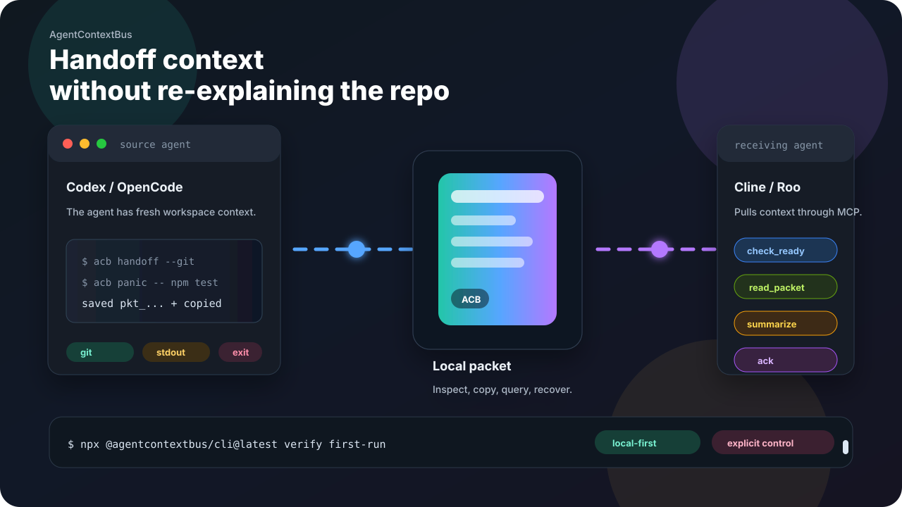
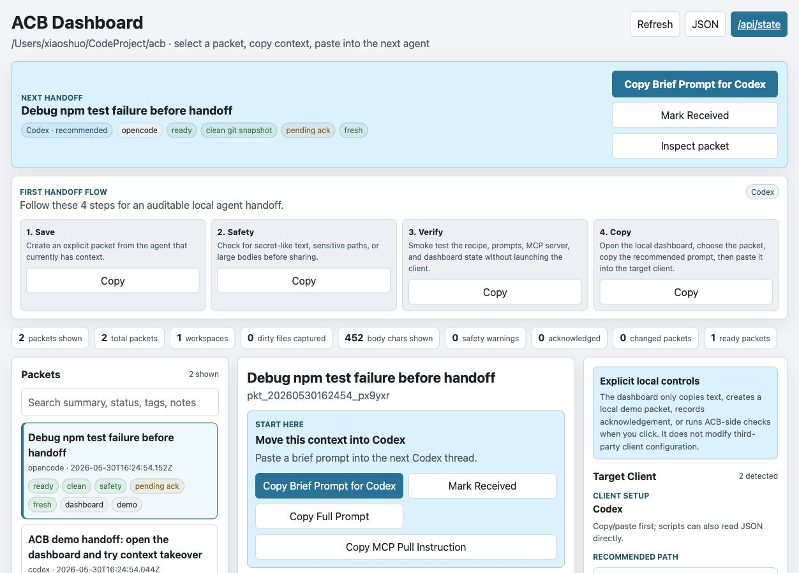
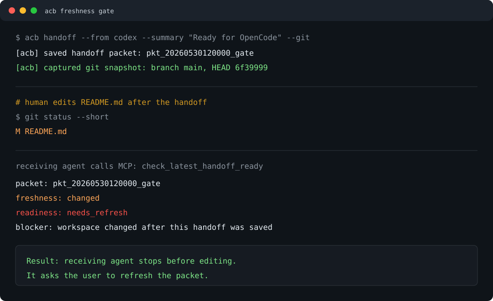

# AgentContextBus (`acb`)

[English](README.md) | [简体中文](README.zh-CN.md)



AgentContextBus is a local-first handoff layer for coding agents. It saves a compact local packet from the current tool, then lets the next tool pull, check, summarize, and acknowledge it through CLI, dashboard, or MCP.

Use it when switching between Codex, OpenCode, Cline, Roo Code, Claude Desktop, scripts, and terminals without re-explaining the same workspace state.

## What You Get

> **Save the handoff**
> `acb handoff --git` captures summary, workspace, Git snapshot, watched files, and optional diff.

> **Carry terminal failures**
> `acb panic -- npm test` preserves the command, exit code, stdout, stderr, duration, and repo state.

> **Let agents pull context**
> MCP clients can call `check_latest_handoff_ready`, read the packet, summarize it, and acknowledge receipt.

> **Keep it inspectable**
> `acb dashboard` shows packets, safety hints, freshness, acknowledgements, and client setup locally.

## Start Here

### Fast smoke test

```bash
npx @agentcontextbus/cli@latest verify first-run
```

Uses a temporary local store. Nothing is written to your real ACB store unless you set `ACB_STORE`.

### Visual demo

```bash
npx @agentcontextbus/cli@latest demo
npx @agentcontextbus/cli@latest dashboard --workspace .
```

Creates a demo packet and opens the local dashboard. Try `Save`, `Safety`, `Verify`, and `Copy` in the first viewport.

### Daily CLI

```bash
npm install -g @agentcontextbus/cli
acb quickstart --check
```

Installs the short `acb` command and prints the next commands for your workspace.

<details>
<summary>Package name note</summary>

The package is published as `@agentcontextbus/cli` and installs the short `acb` command. Use the scoped package name; the unscoped `acb` npm package name is already taken. The earlier `@xiaoshuo1988/acb` package remains available as a legacy compatibility path.

</details>

## Install

```bash
npm install -g @agentcontextbus/cli
acb quickstart --check
```

Or run without installing:

```bash
npx @agentcontextbus/cli quickstart --check
```

The check also prints a recommended client target, human-readable `Next actions`, and script-friendly `acb demo`, `acb setup --check`, `acb verify workflow`, and `acb dashboard` next steps.

To explore ACB before you have real handoff history, create a local demo packet:

```bash
acb demo
acb dashboard --workspace .
```

To self-test the full first-run path without touching your real store:

```bash
acb verify first-run
```

## Trust Boundary

> **What ACB does:** saves local packets, renders copyable prompts, exposes explicit MCP tools, checks freshness and safety hints, and records acknowledgements.

> **What ACB does not do:** no hidden prompt injection, no traffic interception, no cloud sync, and no silent client-private-storage edits.

Every save, read, recover, copy, and acknowledgement is an explicit local action.

## 60 Second Flow

1. Save context:

   ```bash
   acb handoff --from codex --summary "Ready for OpenCode to continue" --git
   ```

   Creates a local packet and copies a handoff prompt.

2. Capture a failing terminal moment:

   ```bash
   acb panic -- npm test
   ```

   Stores the command, exit code, stdout, stderr, duration, and optional Git state.

3. Receive through a readiness gate:

   ```bash
   acb receive --latest
   acb receive --latest --brief
   ```

   Checks freshness and safety before copying a full or brief takeover prompt.

4. Close the loop:

   ```bash
   acb ack --latest --by opencode --note "Read packet and continuing from it."
   ```

   Records an explicit acknowledgement visible in CLI, JSON, MCP, and dashboard views.

5. Check an older packet:

   ```bash
   acb freshness --latest
   acb ready --latest
   ```

   Summarizes freshness, safety, acknowledgement, and context-body signals.

For non-Git or ignored-but-important files, opt in explicitly with watched paths:

```bash
acb handoff --summary "Ready for next agent" --watch README.md --watch package.json
```

You can also create `.acb/watch` with one workspace-relative path per line. ACB fingerprints only those explicit paths; it does not scan your whole workspace by default.

For a shorter first message, run `acb brief`. It copies a compact takeover summary and points the receiving agent to the full packet when needed.

## Visual Demos






Need a client-specific path:

```bash
acb recipe opencode
acb recipe cline
acb setup codex --workspace . --check
```

Want to inspect the local handoff state visually:

```bash
acb dashboard --workspace .
```

## What Gets Saved

By default ACB stores local JSON at:

```text
~/.acb/packets.json
```

Each packet can include:

- Summary, status, notes, tags, and optional body text.
- Workspace path.
- Lightweight Git snapshot with repo root, branch, short HEAD, and `git status --short`.
- Optional bounded tracked diff when you explicitly pass `--diff`.
- Optional acknowledgement entries when a receiving agent explicitly runs `acb ack`, clicks `Mark Received`, or calls `acknowledge_handoff`.

ACB also derives safety hints when packets are read or displayed. These hints flag secret-like text, sensitive-looking paths such as `.env` or key files, and large bodies that will be truncated in prompts. They are review aids only; ACB does not silently redact or mutate your packet contents.

Review the latest packet for the current workspace:

```bash
acb safety
acb safety --json
acb verify safety
```

Override the store for experiments:

```bash
ACB_STORE=./tmp/acb-packets.json acb handoff --summary "Test handoff"
```

## Copy/Paste Mode

This is the safest first path because every client has a text box.

```bash
acb handoff --from codex --summary "Implemented local store" --status "tests pass" --note "Review docs next"
acb resume
```

Useful variants:

```bash
acb handoff --from codex --summary "Ready for review" --git
acb save --from opencode --summary "Longer context" --file ./handoff.md --copy
git diff -- README.md | acb save --from script --summary "Review README diff" --stdin
```

## MCP Pull Mode

MCP-capable clients can read and write handoffs explicitly:

```bash
acb config mcp --out ./mcp.json
acb verify mcp --config ./mcp.json --name acb
```

Expose that config to your client. Then tell the downstream agent:

```text
Use acb to read the latest handoff for this workspace, then continue from it.
```

For safer receiving agents, ask the client to check readiness after reading and stop if ACB reports `needs_refresh` or `needs_review`.

For copyable client/system prompt patches that make receiving agents check ACB before editing, see [Agent instructions](docs/agent-instructions.md).

`acb setup <target>` also prints a copyable Agent instruction patch. Paste that patch into the target client's custom instructions, project rules, or system-prompt area after you configure MCP.

The MCP server exposes:

- `get_workspace_status`
- `read_latest_handoff`
- `read_handoff_brief`
- `check_latest_handoff_ready`
- `check_handoff_ready`
- `read_handoff`
- `save_handoff`
- `generate_missed_handoff`
- `update_handoff`
- `acknowledge_handoff`
- `search_handoffs`
- `list_handoffs`
- `list_workspaces`

See [docs/recipes/mcp-clients.md](docs/recipes/mcp-clients.md).

## Client Recipes

`acb recipe` turns the safe handoff boundary into concrete steps for common clients:

```bash
acb recipe
acb recipe opencode
acb recipe cline
acb recipe roo
acb recipe claude-desktop
acb recipe codex
acb recipe generic-mcp
```

Recipes are intentionally explicit. They give copy/paste, MCP pull, and verification steps without editing private client state. For a fuller copyable setup guide, use:

```bash
acb setup
acb setup --check
acb setup codex
acb setup opencode --workspace . --json
```

Without a target, `acb setup` uses the same read-only detection as the dashboard and picks the best local target. The dashboard surfaces the same setup guide next to the detected target list.
Add `--check` to run the same ACB-side workflow smoke test inline before you copy setup commands into a client.
The setup guide also prints an Agent instruction patch so the receiving agent knows to call `check_latest_handoff_ready`, read the packet, summarize it, and acknowledge it before editing.

## Workflow Verification

Before trying a client by hand, run an ACB-side workflow smoke test:

```bash
acb verify workflow opencode
acb verify workflow cline --json
acb verify workflow --all
acb setup codex --check
```

This verifies the local recipe, handoff packet, brief, full resume prompt, MCP server, and dashboard state. Use `--all` as the release-readiness matrix across every supported client target. The dashboard can run the same ACB-side check from the selected client's setup guide. It does not launch or mutate the third-party client.

## Examples

- [First run](docs/first-run.md)
- [Five-minute demo](docs/examples/five-minute-demo.md)
- [Freshness gate demo](docs/examples/freshness-gate-demo.md)
- [Codex client handoff](docs/examples/codex-client.md)
- [OpenCode client handoff](docs/examples/opencode-client.md)
- [Codex to OpenCode handoff](docs/examples/codex-to-opencode.md)
- [Terminal demo transcript](docs/examples/terminal-demo.md)
- [SDK and LangChain handoff](docs/examples/sdk-handoff.md)
- [MCP client recipes](docs/recipes/mcp-clients.md)
- [Agent instructions](docs/agent-instructions.md)
- [FAQ](docs/faq.md)
- [Brief mode](docs/brief.md)
- [Dashboard](docs/dashboard.md)
- [CLI output contract](docs/cli-contract.md)
- [Store schema](docs/store-schema.md)
- [Workflow verification](docs/workflow-verification.md)
- [Local HTML viewer](docs/viewer.md)
- [Local-first design notes](docs/local-first-design.md)
- [Product direction](docs/product-direction.md)

## Commands

```bash
acb quickstart
acb quickstart --check
acb demo
acb handoff --from <agent> --summary <text> --status <text> --note <text>
acb handoff --git
acb panic -- npm test
acb receive --latest
acb resume
acb brief
acb ack --latest --by <agent>
acb freshness --latest
acb ready --latest
acb save --from <agent> --summary <text> --file <path> --copy
acb save --from <agent> --summary <text> --stdin
acb save --from <agent> --summary <text> --git
acb save --from <agent> --summary <text> --watch README.md
acb save --from <agent> --summary <text> --diff
acb update <packet-id> --status <text> --note <text>
acb status
acb latest
acb show <packet-id> --prompt
acb preview --open
acb list
acb workspaces
acb search <query>
acb timeline
acb safety
acb view --open
acb dashboard --workspace .
acb recipe opencode
acb verify workflow opencode
acb verify first-run
acb verify safety
acb export --format markdown --out ./handoffs.md
acb import --file ./handoffs.json
acb delete <packet-id>
acb clear --workspace .
acb doctor
acb config mcp --out ./mcp.json
acb integrate cline --dry-run
acb verify mcp --config ./mcp.json
acb serve
acb store info
acb store backup --out ./acb-store.backup.json
```

## First-Run Checks

`acb quickstart --check` prints the short readiness report:

- Installed ACB version.
- Local store readability.
- Clipboard availability or fallback behavior.
- Current workspace and Git detection.
- Recommended target client and setup command.
- Next handoff, receive, resume, dashboard, workflow verify, doctor, and MCP commands.
- Next brief command for compact takeover prompts.

`acb verify first-run` runs a temporary first-run smoke test covering quickstart readiness, demo packet creation, brief/resume rendering, dashboard state, and setup workflow checks. It does not write to your real ACB store unless you pass `ACB_STORE` yourself.

`acb doctor` prints a deeper diagnostic report, including MCP install hints when `acb` is not visible on `PATH`.

## Local Viewer

`acb view` writes a standalone HTML file for reviewing recent handoffs:

```bash
acb view --open
acb view --all --limit 50 --out ./acb-view.html
```

The viewer is a static local file. It does not start a server, sync data, or watch your workspace.

## Dashboard

`acb dashboard` starts an explicit local control surface:

```bash
acb dashboard --workspace .
acb dashboard --all --limit 50 --port 8765
```

It serves a lightweight HTML dashboard, `/api/state`, and local-only takeover buttons. If the workspace is empty, the dashboard can create one explicit local demo packet so the first screen becomes inspectable immediately. The top `Next handoff` strip auto-selects the best detected target client and keeps the recommended copy action visible, while the packet detail `Start here` panel still offers brief, full, and MCP pull instruction copies plus an explicit `Mark Received` acknowledgement. The side panel lists detected target clients such as OpenCode, Cline, Roo Code, Claude Desktop, Codex, and generic MCP, then shows a compact setup checklist: save context, review safety, verify the ACB-side workflow, and open the dashboard handoff path. The packet detail also has readiness, Safety, freshness, and acknowledgement tabs so you can see whether a handoff needs refresh or review before you continue. It does not silently inject prompt text or edit any client configuration.

The default host is `127.0.0.1`. Keep it loopback-only unless you trust the network, because the dashboard includes local store metadata, workspace paths, and clipboard-copy controls. A `--workspace` dashboard only shows packets and workspace summaries for that workspace; use `--all` when you intentionally want a global view.

## Brief Mode

`acb brief` creates a compact receiving-side prompt:

```bash
acb brief
acb brief --id <packet-id> --print-brief
acb brief --json
```

Use it when the next client has a small input box or when you want the receiving agent to start with a short, auditable summary before pulling full context.

## Boundaries

ACB v0.5.0 is a local handoff layer, not a hidden control plane.

It does not:

- Inject prompts into model requests.
- Mutate third-party app databases or private config files.
- Automatically decide what another agent should know.
- Replace a coding agent.

It does:

- Save explicit handoff packets.
- Render paste-ready prompts.
- Provide explicit MCP read/write tools.
- Provide explicit local dashboard, client setup guide, and workflow verification surfaces.
- Keep state local and inspectable.

## Relationship To DeepSeek CompatKit

DeepSeek CompatKit is diagnostics infrastructure for DeepSeek/OpenAI-compatible agent traffic.

AgentContextBus is a separate local handoff project. It may eventually reuse lessons from CompatKit, but it keeps its own product boundary.
