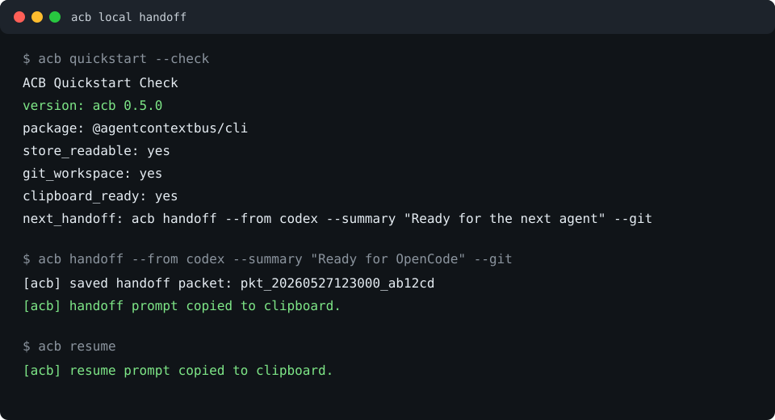

# AgentContextBus (`acb`)

[English](README.md) | 简体中文

AgentContextBus 是一个 local-first 的编码 Agent 上下文交接 CLI。

它解决一个很常见的问题：

> 我在 Codex、OpenCode、Cline、Claude Code、脚本和终端之间切换时，不想一遍遍解释当前项目做到哪里了。

ACB 让当前 Agent 留下一个本地上下文包，然后让下一个 Agent 通过可复制的提示词、dashboard 复制按钮或显式 MCP 工具读取它。

ACB 的边界很明确：

- 不做隐藏 prompt 注入。
- 默认不拦截网络流量。
- 不修改 Cline、Roo、OpenCode、VS Code、Claude Desktop 等客户端的私有存储。
- 不做后台跨 Agent 自动化。
- 不做云同步或托管 dashboard。

npm 主包名是 `@agentcontextbus/cli`，安装后提供短命令 `acb`。请使用 scoped 包名；未加 scope 的 `acb` npm 包名已经被占用。早期的 `@xiaoshuo1988/acb` 会继续作为兼容路径保留。

## 30 秒试用

```bash
npx @agentcontextbus/cli@latest quickstart --check --lang zh-CN
npx @agentcontextbus/cli@latest demo --lang zh-CN
npx @agentcontextbus/cli@latest dashboard --workspace . --lang zh-CN
```

这会创建一条本地 demo packet，并打开 dashboard。进入页面后，先看首屏的 `第一次交接流程`：保存上下文、检查安全、验证流程、复制交接。

如果你想先做完全不写真实 store 的 smoke test：

```bash
npx @agentcontextbus/cli@latest verify first-run --lang zh-CN
```

`verify first-run` 会用临时本地 store 检查 quickstart、demo packet、brief/resume、dashboard state 和 setup workflow。除非你自己传入 `ACB_STORE`，否则不会写入真实 ACB store。

关于自动启动、剪贴板、客户端配置、数据位置等常见疑问，见 [常见问题](docs/zh-CN/faq.md)。



## 安装

```bash
npm install -g @agentcontextbus/cli
acb quickstart --check
```

中文终端输出：

```bash
acb quickstart --check --lang zh-CN
```

也可以设置环境变量：

```bash
ACB_LANG=zh-CN acb quickstart --check
```

也可以不安装，直接运行：

```bash
npx @agentcontextbus/cli quickstart --check
```

检查结果会给出推荐目标客户端、适合人看的“推荐下一步”，以及适合脚本读取的 `acb demo`、`acb receive --latest`、`acb setup --check`、`acb verify workflow` 和 `acb dashboard` 命令。

如果还没有真实 handoff 历史，可以先创建一条本地示例上下文包：

```bash
acb demo --lang zh-CN
acb dashboard --workspace . --lang zh-CN
```

如果想先验证完整首次路径但不写入真实 store：

```bash
acb verify first-run --lang zh-CN
```

## 60 秒流程

在掌握当前上下文的 Agent 里运行：

```bash
acb handoff --from codex --summary "Ready for OpenCode to continue" --git
```

ACB 会保存一个本地上下文包，并把交接提示词复制到剪贴板。

在下一个 Agent 或终端里运行：

```bash
acb receive --latest
```

`receive` 会先检查这个 packet 是否适合交接。通过检查后，它会把接手提示词复制到剪贴板；如果系统剪贴板不可用，ACB 会把提示词打印到终端，方便手动复制。

当接收端 Agent 读完 packet 后，可以显式记录一条本地接收确认：

```bash
acb ack --latest --by opencode --note "已读取 packet，并会从这个上下文继续。"
```

这样 `acb show`、`acb status`、JSON 输出、MCP 读取和 dashboard 都能看到这次 handoff 是否已经闭环。

如果 packet 已经保存了一段时间，可以先检查工作区是否已经变化：

```bash
acb freshness --latest
```

默认情况下，freshness 使用 `--git` 保存的 Git 快照。如果有非 Git 文件、被 ignore 但确实影响交接的关键文件，可以显式 watch：

```bash
acb handoff --summary "Ready for next agent" --watch README.md --watch package.json
```

也可以创建 `.acb/watch`，每行写一个 workspace 相对路径。ACB 只会 fingerprint 这些显式路径，不会默认扫描整个项目。

如果想要一个综合的交接前判断：

```bash
acb ready --latest
```

`ready` 会把 freshness、safety、接收确认和上下文正文情况汇总成明确的 `ready: yes/no`，并给出下一步命令。

如果想把“接收前检查 + 复制接手提示词”合成一步：

```bash
acb receive --latest
acb receive --latest --brief
```

`acb receive` 会在复制前拦住过期或有安全风险的 packet。它不会自动标记接收确认；等接收端 Agent 复述 packet 后，再运行 `acb ack`。

如果想先给下一个 Agent 一个更短的起步消息：

```bash
acb brief
```

`acb brief` 会复制一个精简接管摘要，并告诉接收方需要完整上下文时如何读取完整 packet。

想使用某个客户端的推荐路径：

```bash
acb recipe opencode
acb recipe cline
acb setup codex --workspace . --check
```

更具体的接收端示例见英文文档：

- [Codex client handoff](docs/examples/codex-client.md)
- [OpenCode client handoff](docs/examples/opencode-client.md)

想用可视化方式检查本地交接历史：

```bash
acb dashboard --workspace .
```

## 保存在哪里

默认情况下，ACB 把本地 JSON 存在：

```text
~/.acb/packets.json
```

每个上下文包可以包含：

- summary、status、notes、tags 和可选正文。
- workspace 路径。
- 轻量 Git 快照，包括 repo root、branch、short HEAD 和 `git status --short`。
- 当你显式传入 `--diff` 时，可附带有长度上限的 tracked diff。
- 当接收端显式运行 `acb ack`、点击 `Mark Received` 或调用 `acknowledge_handoff` 时，会记录 acknowledgement。

实验时可以覆盖 store 路径：

```bash
ACB_STORE=./tmp/acb-packets.json acb handoff --summary "Test handoff"
```

## 复制粘贴模式

这是最安全的第一条路径，因为几乎所有客户端都有文本输入框。

```bash
acb handoff --from codex --summary "Implemented local store" --status "tests pass" --note "Review docs next"
acb resume
```

常用变体：

```bash
acb handoff --from codex --summary "Ready for review" --git
acb save --from opencode --summary "Longer context" --file ./handoff.md --copy
git diff -- README.md | acb save --from script --summary "Review README diff" --stdin
```

## MCP 拉取模式

支持 MCP 的客户端可以显式读取和写入 handoff：

```bash
acb config mcp --out ./mcp.json
acb verify mcp --config ./mcp.json --name acb
```

把生成的配置接入你的客户端后，告诉下游 Agent：

```text
Use acb to read the latest handoff for this workspace, then continue from it.
```

更稳妥的接收端流程是：读取 handoff 后先检查 readiness；如果 ACB 返回 `needs_refresh` 或 `needs_review`，就先停下并请用户刷新或检查。

如果希望接收端 Agent 在新 session 里主动先查 ACB，可以复制 [Agent 指令补丁](docs/zh-CN/agent-instructions.md)。

`acb setup <target>` 也会直接打印一段可复制的长期指令补丁。把它粘贴到目标客户端的 custom instructions、project rules 或 system prompt 区域，接收端 Agent 就知道要先调用 `check_latest_handoff_ready`、读取 packet、复述确认并调用 `acknowledge_handoff`。

MCP server 暴露这些工具：

- `get_workspace_status`
- `read_latest_handoff`
- `read_handoff_brief`
- `check_latest_handoff_ready`
- `check_handoff_ready`
- `read_handoff`
- `save_handoff`
- `update_handoff`
- `acknowledge_handoff`
- `search_handoffs`
- `list_handoffs`
- `list_workspaces`

## 客户端配方

`acb recipe` 会把安全边界变成具体客户端步骤：

```bash
acb recipe
acb recipe opencode
acb recipe cline
acb recipe roo
acb recipe claude-desktop
acb recipe codex
acb recipe generic-mcp
```

如果想要更完整、可复制的接入指南：

```bash
acb setup
acb setup --check
acb setup --check --lang zh-CN
acb setup codex
acb setup opencode --workspace . --json
```

不指定目标时，`acb setup` 会使用和 dashboard 相同的只读检测逻辑，选择最合适的本地目标客户端。加上 `--check` 后，它会在展示接入步骤后运行 ACB 侧 workflow smoke test。

`acb setup` 会优先打印一条紧凑的推荐路径：保存当前上下文、检查 safety、验证 ACB 侧 workflow，然后打开 dashboard，把推荐交接文本复制到目标客户端。JSON 输出里也有同样的 `steps` 数组，方便 dashboard 或脚本复用。

它还会输出 `agent_instruction_patch`，用于一次性配置接收端 Agent 的主动检查行为。

## Workflow 验证

在手动接入客户端之前，可以先验证 ACB 这一侧是否准备好：

```bash
acb verify workflow opencode
acb verify workflow cline --json
acb verify workflow --all
acb setup codex --check
```

它会验证 recipe、handoff packet、brief、完整 resume prompt、MCP server 和 dashboard state。`--all` 可以作为发布前的全目标矩阵检查。这个过程不会启动或修改第三方客户端。

要看 “handoff 后人类又改了文件，接收端应该被拦住” 的最短 demo：

```bash
acb demo freshness --lang zh-CN
```

这个命令会创建临时 Git workspace，保存 handoff snapshot，然后模拟 handoff 后的 README 改动，最终显示 `readiness: needs_refresh`。

## 可视化 Dashboard

```bash
acb dashboard --workspace .
acb dashboard --workspace . --lang zh-CN
```

Dashboard 是一个显式启动的本地控制面板：

- 查看当前 workspace 的 handoff 历史。
- 如果当前 workspace 还是空的，可以一键创建本地 demo packet。
- 搜索和检查 packet 细节。
- 查看交接状态、freshness、safety 和接收确认。
- 一键复制 brief、full prompt 或 MCP pull instruction。
- 自动只读检测 OpenCode、Cline、Roo Code、Claude Desktop、Codex 和 generic MCP 等目标。
- 为目标客户端展示紧凑 setup checklist 和 ACB-side check。

默认监听 `127.0.0.1`。除非你明确知道自己在做什么，否则不要用 `--host 0.0.0.0` 暴露到局域网。

## 常用命令

```bash
acb quickstart --check
acb demo --lang zh-CN
acb handoff --from <agent> --summary <text> --git
acb save --from <agent> --summary <text> --watch README.md
acb receive --latest
acb resume
acb brief
acb ack --latest --by <agent>
acb freshness --latest
acb ready --latest
acb dashboard --workspace .
acb setup --check
acb verify first-run --lang zh-CN
acb verify workflow --all
acb doctor
acb config mcp --out ./mcp.json
acb verify mcp --config ./mcp.json --name acb
acb store backup --out ./acb-store.backup.json
```

## 中文快速上手

更短的中文上手说明见 [docs/zh-CN/quickstart.md](docs/zh-CN/quickstart.md)。
常见问题见 [docs/zh-CN/faq.md](docs/zh-CN/faq.md)。
Agent 指令补丁见 [docs/zh-CN/agent-instructions.md](docs/zh-CN/agent-instructions.md)。
英文首次运行完整路径见 [docs/first-run.md](docs/first-run.md)。
CLI 输出稳定性说明见 [docs/cli-contract.md](docs/cli-contract.md)，store schema 见 [docs/store-schema.md](docs/store-schema.md)。
